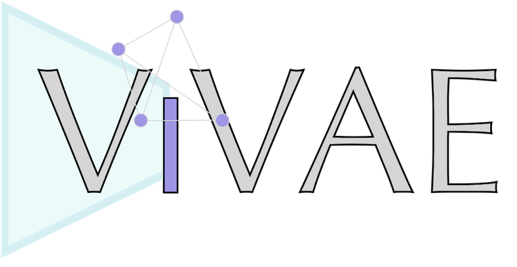

ViVAE (*vee-vay*) is a toolkit for single-cell data denoising and dimensionality reduction.

It is published together with **[ViScore](https://github.com/saeyslab/ViScore)**, a collection of tools for evaluation of dimensionality reduction.
Our [pre-print](https://www.biorxiv.org/content/10.1101/2023.11.23.568428v2) uses an [older version](https://github.com/saeyslab/ViVAE_old) of ViVAE.
We are heavily re-working the pre-print right now!

## Why use ViVAE

* ViVAE strikes a favourable balance between local and global structure preservation.
    * This is especially good for data with trajectories, outlier populations or suspected batch effects.
* ViVAE implements encoder indicatrices: a tool to measure local distortions of latent space.
* ViVAE integrates with [FlowSOM](https://github.com/saeyslab/FlowSOM_Python) for visualisation.
* ViVAE is a parametric model, enabling transfer learning and embedding of new points.

## Installation

<details>
<summary><b>Python installation</b></summary>
<br>

ViVAE is a Python package based on PyTorch.
We recommend creating a new Anaconda environment for it.

On Linux or macOS, use the command line for installation.
On Windows, use Anaconda Prompt.

```bash
conda create --name ViVAE python=3.11.7 \
    numpy==1.26.3 numba==0.59.0 pandas==2.2.0 matplotlib==3.8.2 scipy==1.12.0 pynndescent==0.5.11 scikit-learn==1.4.0 scanpy==1.9.8 pytorch==2.1.2
conda activate ViVAE
pip install git+https://github.com/saeyslab/FlowSOM_Python.git@80529c6b7a1747e8e71042102ac8762c3bfbaa1b
pip install --upgrade git+https://github.com/saeyslab/ViVAE.git
```

GPU acceleration is recommended if available.
To verify whether PyTorch can use CUDA, activate your ViVAE environment and type:

```bash
python -c "import torch; print(torch.cuda.is_available())"
```

Alternatively, to verify whether PyTorch can use Metal (on AMD/Apple Silicon Macs):

```bash
python -c "import torch; print(torch.backends.mps.is_available())"
```

This will print either `True` or `False`.

<hr>
</details>

<details>
<summary><b>R installation</b></summary>
<br>

We are working on an R implementation of ViVAE that is independent of PyTorch.
In the meantime, to install and run ViVAE in R using [reticulate](https://rstudio.github.io/reticulate/), use our [R vignette](https://github.com/saeyslab/ViVAE/blob/main/example_r.Rmd) (an RMarkdown file).

<hr>
</details>

## Tutorials

<details>
<summary><b>Using ViVAE with scRNA-seq data</b></summary>
<br>

ViVAE was primarily designed for, and tested with, single-cell transcriptomic datasets.
We provide an example workflow for analysis of bone marrow transcriptome data with ViVAE.
The tutorial is provided as a Jupyter notebook [here](https://github.com/saeyslab/ViVAE/blob/main/example_scrnaseq.ipynb).

<hr>
</details>

<details>
<summary><b>Using ViVAE with cytometry data</b></summary>
<br>

ViVAE is straightforward to use with flow and mass cytometry data.
Its structure-preserving properties are especially advantageous if global structures are of interest.
Additionally, ViVAE integrates with FlowSOM to provide a graph-based view of cytometry datasets.

We provide a Jupyter notebook tutorial [here](https://github.com/saeyslab/ViVAE/blob/main/example_cytometry.ipynb) here that covers importing and pre-processing of data, denoising, dimensionality reduction and evaluation of the resulting embedding.

In addition, our [R installation vignette](https://github.com/saeyslab/ViVAE/blob/main/example_r.Rmd) shows how to use ViVAE denoising and dimensionality reduction from R.

<hr>
</details>

In these tutorials we cover

* import of input files
* standard pre-processing workflow
* dimensionality reduction and hyperparameter tuning
* integration of ViVAE with FlowSOM
* encoder indicatrices for detection of localised distortions
* evaluation of structure preservation with [ViScore](https://github.com/saeyslab/ViScore)
* evaluation of distortions of annotated populations with ViScore using the xNPE scoring metric
* saving and loading trained ViVAE models

## Benchmarking

We benchmark ViVAE and other DR methods in terms of local and global structure preservation, using [ViScore](https://github.com/saeyslab/ViScore).
The ViScore repository contains our documented [benchmarking set-up](https://github.com/saeyslab/ViScore/blob/main/benchmarking), which can be extended to other datasets and DR methods.

## Pre-print

The pre-print of our publication is available [here](https://www.biorxiv.org/content/10.1101/2023.11.23.568428v2) on bioRxiv.

It describes underlying methodology of ViVAE and ViScore, reviews past work in dimensionality reduction and evaluation of it and links to publicly available datasets on which performance of ViVAE was evaluated.
**We are heavily revising this pre-print.**

The pre-print currently uses the old version of *ViVAE*, available [here](https://github.com/saeyslab/ViVAE_old).
