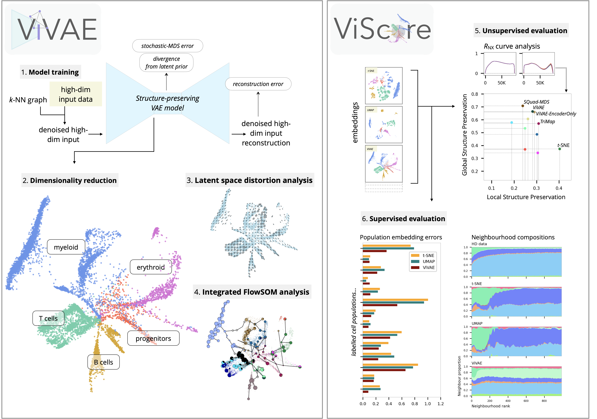

ViVAE (*vee-vay*) is a toolkit for single-cell data denoising and dimensionality reduction.

It is published together with **[ViScore](https://github.com/saeyslab/ViScore)**, a framework for fair and scalable evaluation of dimensionality reduction.
Check out the associated [paper](https://www.biorxiv.org/content/10.1101/2023.11.23.568428v3): *Interpretable models for scRNA-seq data embedding with multi-scale structure preservation*, where we describe and validate our methods in-depth.



## Why use ViVAE

* ViVAE achieves state-of-the-art multi-scale structure preservation.
    * This is especially, but not exclusively, suitable for data with trajectories, outlier populations or suspected batch effects.
* Our embedding model implements encoder indicatrices: a tool to measure local distortions of latent space.
* We integrate ViVAE with [FlowSOM](https://github.com/saeyslab/FlowSOM_Python) for visualisation.
* The ViVAE model is parametric, enabling transfer learning and embedding of new points.
* ViVAE can take advantage of modern GPU architectures, especially for training on large datasets.

## Setting up

For most datasets, ViVAE can be run on a consumer laptop.
Availability of a GPU is a significant boost.

To try out ViVAE without installing it locally, follow the tutorial in `tutorials/example_scrnaseq.ipynb` to use ViVAE in [Google Colab](https://colab.research.google.com).

<details>
<summary><b>Python installation</b></summary>
<br>

ViVAE is a Python package based on PyTorch.
We recommend creating a new Anaconda environment for it.

On Linux or macOS, use the command line for installation.
On Windows, use Anaconda Prompt.

```bash
conda create --name ViVAE python=3.11.7 \
    numpy==1.26.3 numba==0.59.0 pandas==2.2.0 matplotlib==3.8.2 scipy==1.12.0 pynndescent==0.5.11 scikit-learn==1.4.0 scanpy==1.9.8 pytorch==2.1.2
conda activate ViVAE
pip install git+https://github.com/saeyslab/FlowSOM_Python.git@80529c6b7a1747e8e71042102ac8762c3bfbaa1b
pip install --upgrade git+https://github.com/saeyslab/ViVAE.git
```

GPU acceleration is recommended if available.
To verify whether PyTorch can use CUDA, activate your ViVAE environment and type:

```bash
python -c "import torch; print(torch.cuda.is_available())"
```

Alternatively, to verify whether PyTorch can use Metal (on AMD/Apple Silicon Macs):

```bash
python -c "import torch; print(torch.backends.mps.is_available())"
```

This will print either `True` or `False`.

<hr>
</details>

<details>
<summary><b>R installation</b></summary>
<br>

We are working on an R implementation of ViVAE that is independent of PyTorch.
In the meantime, to install and run ViVAE in R using [reticulate](https://rstudio.github.io/reticulate/), use our R vignette (`tutorials/example_r.Rmd`) (an RMarkdown file you can open in RStudio).

</details>

## Tutorials

Our tutorials will help you start using ViVAE quickly, be it with scRNA-seq or cytometry data.
The tutorials include data pre-processing, discuss the most important hyperparameters of ViVAE and touch on evaluation of embeddings using [ViScore](https://github.com/saeyslab/ViScore).

<details>
<summary><b>Using ViVAE with scRNA-seq data</b></summary>
<br>

ViVAE was primarily designed for, and tested with, single-cell transcriptomic datasets.

To get you started, we provide an example workflow for analysis of bone marrow single-cell transcriptomic data with ViVAE.
We evaluate the separation of distincts immune cell lineages and general structure preservation by ViVAE, t-SNE and UMAP.

Additionally, we compute embedding errors by population and demonstrate the use of neighbourhood composition plots for explaining sources of error.

Advantages and potential pitfalls of smooth embeddings are described and discussed.

The tutorial is provided as a Jupyter notebook (`tutorials/example_scrnaseq.ipynb`).

<hr>
</details>

<details>
<summary><b>Using ViVAE with cytometry data</b></summary>
<br>

ViVAE, while intended mainly for scRNA-seq data, is straightforward to use with flow and mass cytometry data as well.

Its structure-preserving properties are especially advantageous if global structures are of interest.
Additionally, ViVAE integrates with FlowSOM to provide a graph-based view of cytometry datasets.

We provide a Jupyter notebook tutorial (`tutorials/example_cytometry.ipynb`) that covers importing and pre-processing of data, denoising, dimensionality reduction and some evaluation of the resulting embedding.

Our R installation vignette (`tutorials/example_r.Rmd`) shows how to use ViVAE denoising and dimensionality reduction from R.

<hr>
</details>

We also showcase some experimental modifications of the model that will mostly be interesting for developers of dimensionality reduction algorithms, below.

<details>
<summary><b>Interesting modifications of the ViVAE model</b></summary>
<br>

Some additional examples of modifications to the ViVAE model are provided:

* PCA initialisation or general approximation of other DR models using **imitation loss**: `tutorials/imitation.ipynb`.

* Using stochastic-MDS loss with **cosine distances** in input space: `tutorials/cosine.ipynb`.

</details>

## Case studies

The associated manuscript presents case studies on various single-cell datasets.
These case studies are replicated using Jupyter notebooks in the `case_studies` directory.

<details>
<summary><b>Breast immune cells transcriptome study (Reed)</b></summary>
<br>

`case_study_reed.ipynb` provides code to reproduce the [*Reed*](https://cellxgene.cziscience.com/collections/48259aa8-f168-4bf5-b797-af8e88da6637) dataset case study from our paper.
This dataset comes from the Human Breast Cell Atlas.
The authors provide labels for various leukocyte populations.

We compare ViVAE with *t*-SNE and UMAP and describe embedding errors per cell population using the Extended Neighbourhood-Proportion-Error (xNPE) and neighbourhood composition plots.

<hr>
</details>

<details>
<summary><b>Developing zebrafish embryos transcriptome study (Farrell)</b></summary>
<br>

`case_study_farrell.ipynb` provides code to reproduce the [*Farrell*](https://singlecell.broadinstitute.org/single_cell/study/SCP162/single-cell-reconstruction-of-developmental-trajectories-during-zebrafish-embryogenesis) dataset case study from our paper.
This dataset contains cells from multiple stages of zebrafish embryo development.
The authors provide labels of distinct cell lineages.

We compare *t*-SNE, UMAP, a vanilla VAE, default ViVAE and ViVAE-EncoderOnly (a decoder-less model that implements parametric stochastic MDS with GPU acceleration).
The analysis in our paper focuses on the differences between neighbour-embedding algorithms (which tend to form separate clusters) and multi-dimensional scaling algorithms (which produce more continuous represerntations).
We use encoder indicatrices to describe different manners of latent space distortion by the three VAE-based models.

<hr>
</details>

<details>
<summary><b>Mouse bone marrow CyTOF dataset study (Samusik)</b></summary>
<br>

`case_study_samusik.ipynb` provides code to reproduce the [*Samusik*](https://pubmed.ncbi.nlm.nih.gov/27183440/) dataset case study from our paper.
This is a popular reference dataset for showcasing dimensionality reduction and clustering tools.
The authors provide labels for various immune cell populations.

We use ViVAE to create a nice embedding of the data, then use FlowSOM for clustering (independent of the dimension reduction) and show a plot of the embedding with the FlowSOM minimum spanning tree (MST) superimposed.

To explore more options for evaluating cytometry data embeddings and integrating FlowSOM for informative visualisation, we refer you to the cytometry analysis tutorial in `tutorials/example_cytometry.ipynb`.

</details>

## Evaluation framework

In our paper, we compare ViVAE and other DR methods in terms of local and global structure preservation using [ViScore](https://github.com/saeyslab/ViScore).
The ViScore repository contains our documented [benchmarking set-up](https://github.com/saeyslab/ViScore/blob/main/benchmarking), which can be extended to other datasets and DR methods.
This set-up includes full documentation to guide the user through the process of benchmarking or hyperparameter tuning on an HPC cluster from start to finish.

